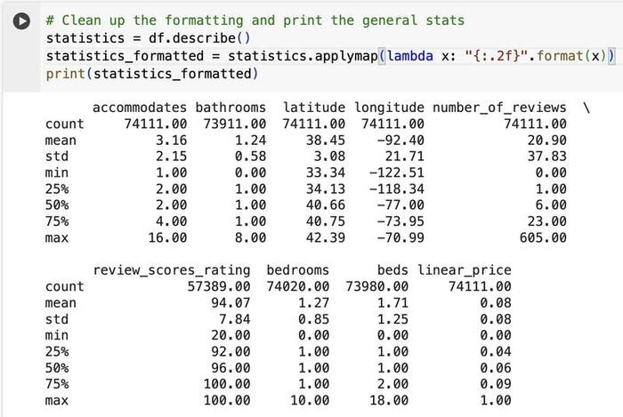
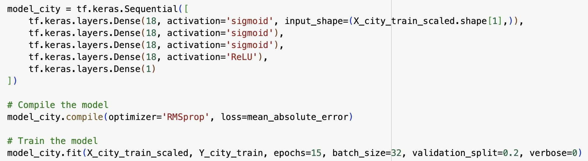
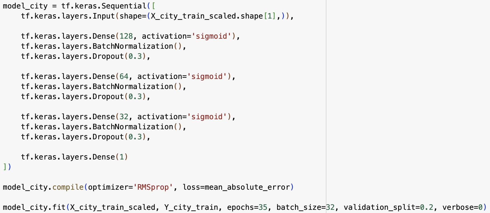

# AirBNBAnalysis

For this project, I analyzed a dataset of AirBNB rentals from across the USA to predict the average review scores and prices. In the increasingly competitive travel industry, understanding how to accurately price your AirBNB rental and which features are valued most by customers is essential knowledge for AirBNB hosts. For this problem, I created a Tensorflow neural network to analyze the amenities provided in each AirBNB and some various information about the host. More specifically, I parsed through AirBNB descriptions to find the most popular amenities and one-hot encoded them, predicted the price of each rental, then calculated how large of an effect each amenity had on the model.

## Dataset

The dataset is a popular Kaggle dataset, [Exploring Global Hospitality: A Comprehensive Dataset of Airbnb Listings](https://www.kaggle.com/datasets/lovishbansal123/airbnb-data), consisting of 78,000 rentals from 6 US cities - NYC, Chicago, Boston, San Francisco, and LA. It contains 29 columns of data, including a detailed list of amenities, neighbourhood and latitude and longitude info, a rental type, and bed/bathroom counts.

## Libraries

* Numpy
* Pandas
* Tensorflow
* Matplotlib
* SKlearn
* OS
* SYS

## Features

* hair dryer
* kid friendly
* instant bookable
* pool
* laptop friendly workspace
* air conditioning
* kitchen
* host has profile pic
* smoke detector
* carbon monoxide detector
* bedrooms
* beds
* host identity verified
* iron
* wireless internet           
* dryer            
* cleaning fee            
* washer 

## General Stats

## Neural Networks

### Price Analysis

### Review Score Analysis

